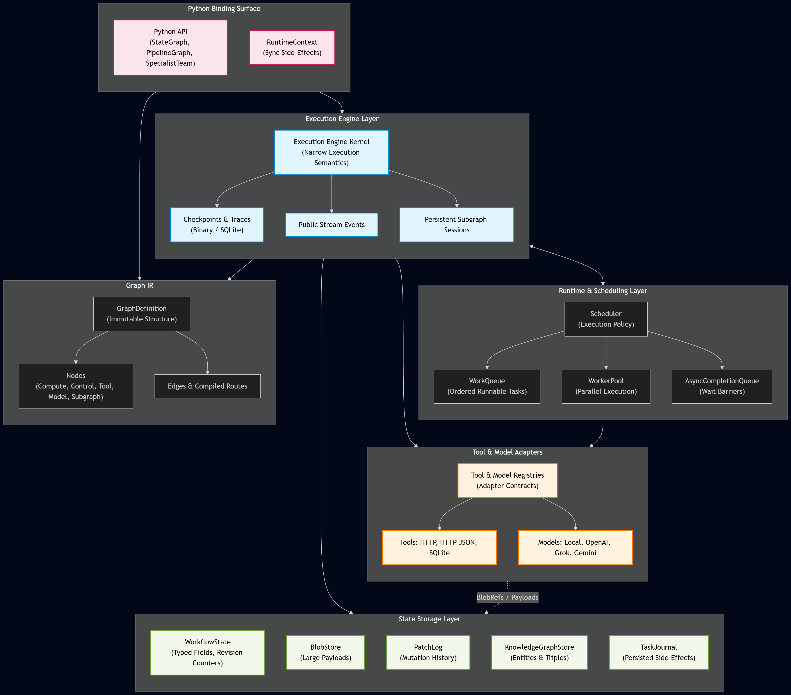

# AgentCore

AgentCore is a native agent-graph runtime written in C++20 with a compact Python surface. It is designed for explicit state flow, deterministic execution, resumable checkpoints, multi-worker scheduling, persistent subgraph sessions, public stream events, and first-class knowledge-graph state.

<p align="center">
  
</p>

## What AgentCore Tries To Do

AgentCore keeps the runtime small in the middle and pushes workflow-specific behavior to graph structure, node logic, and adapters.

That leads to a few practical goals:

- keep the hot path narrow enough to reason about
- make state mutation explicit through patches instead of hidden global writes
- support pause, resume, replay, and inspection without building a second execution model
- let Python users work with a familiar `StateGraph`-style surface while the execution engine stays native
- keep advanced features such as subgraphs, persistent child sessions, and knowledge-graph state inside the same runtime rather than as sidecars

## Architectural Decisions

These are the core choices behind the project.

- Small execution kernel. The engine focuses on node dispatch, patch commit, routing, checkpointing, and resume. Tool logic, model logic, and application policy stay out of the core loop.
- Explicit state patches. Nodes return a `NodeResult` plus a `StatePatch` instead of mutating shared state directly. That gives the runtime one clear commit point for traces, checkpoints, and replay.
- Typed hot state plus blob references. Small workflow state stays cheap to read and update, while larger payloads live out of line.
- Scheduler separated from semantics. The scheduler owns queues, workers, and async wakeups; the engine owns execution meaning and commit order.
- Knowledge graph as runtime state. Graph memory, subscriptions, and graph-aware execution live under the same checkpoint and replay model as ordinary fields.
- Persistent subgraph sessions as isolated child snapshots. Distinct child sessions can run concurrently, while reuse of the same session remains deterministic and resumable.
- Explicit durability profiles. `Strict`, `Balanced`, and `Fast` let users choose how much checkpoint and trace work stays on the hot path without changing state semantics.

## Current Capabilities

- Native C++ runtime with Python bindings
- `StateGraph`-style Python builder and execution surface
- Multi-worker scheduler with async wait handling
- Checkpoints, replay, proof digests, and public stream events
- Subgraph composition with persistent child sessions
- Knowledge-graph-backed state and reactive execution hooks
- Deterministic memoization for supported pure nodes
- Tool and model registries with built-in OpenAI-compatible chat, xAI Grok chat, Gemini `generateContent`, HTTP JSON, SQLite-style, and local model adapters
- Validation-focused benchmarks and smoke coverage in both native and Python paths

## Install

For most Python users, the simplest path is:

```bash
python3 -m pip install agentcore-graph
```

The published package name is `agentcore-graph`, and the import package is `agentcore`.

Current published wheels target Linux `x86_64` for CPython `3.9` through `3.12`. Source builds remain available from this repository.

## First Python Graph

```python
from agentcore.graph import END, START, StateGraph


def step(state, config):
    return {"count": int(state.get("count", 0)) + 1}


def route(state, config):
    return END if state["count"] >= 3 else "step"


graph = StateGraph(dict, name="counter", worker_count=2)
graph.add_node("step", step)
graph.add_edge(START, "step")
graph.add_conditional_edges("step", route, {END: END, "step": "step"})

compiled = graph.compile()
final_state = compiled.invoke({"count": 0})
print(final_state)
```

From there, the same compiled graph can also expose metadata, stream events, batch execution, pause/resume, tool and model registries, and persistent subgraph sessions.

## Build From Source

For a standard local build:

```bash
cmake -S . -B build
cmake --build build -j
ctest --test-dir build --output-on-failure
```

For the optimized validation and benchmark path:

```bash
cmake --preset release-perf
cmake --build --preset release-perf -j
ctest --preset release-perf
./build/release-perf/agentcore_runtime_benchmark
./build/release-perf/agentcore_persistent_subgraph_session_benchmark
```

The repository also includes `relwithdebinfo-perf`, `asan`, `ubsan`, and `tsan` presets.

## How To Navigate The Docs

The main documentation index is [`./docs/README.md`](./docs/README.md). The most useful entry points are:

- [`./docs/quickstarts/python.md`](./docs/quickstarts/python.md) for building the Python bindings, defining graphs, streaming events, using pause/resume, and working with persistent subgraph sessions
- [`./docs/quickstarts/cpp.md`](./docs/quickstarts/cpp.md) for embedding the native runtime from C++
- [`./docs/concepts/runtime-model.md`](./docs/concepts/runtime-model.md) for execution semantics, state, concurrency, sessions, checkpoints, and knowledge-graph behavior
- [`./docs/reference/api.md`](./docs/reference/api.md) for the Python surface and key C++ entry points
- [`./docs/operations/validation.md`](./docs/operations/validation.md) for build, smoke, release, and replay-validation commands
- [`./docs/migration/langgraph-to-agentcore.md`](./docs/migration/langgraph-to-agentcore.md) for moving an existing LangGraph-style graph to AgentCore

## Performance Notes

Current benchmark snapshots and reproduction commands live in [`./docs/comparisons/langgraph-head-to-head.md`](./docs/comparisons/langgraph-head-to-head.md).

Those numbers are useful as a validation artifact for this repository and for side-by-side comparison on the same workloads, but they should be read as machine- and workload-specific measurements rather than universal claims.

## Repository Map

The repository is organized by subsystem:

- `./agentcore/include` and `./agentcore/src` contain the native runtime
- `./agentcore/adapters` contains built-in tool and model adapters
- `./agentcore/tests` and `./agentcore/benchmarks` contain native validation and benchmark entry points
- `./python/agentcore` contains the Python package layered over the native module
- `./python/tests` and `./python/benchmarks` contain Python smoke tests and benchmark entry points
- `./docs` contains the guides, concepts, reference material, migration notes, and validation docs

## Acknowledgements

AgentCore is an independent project and is not affiliated with or endorsed by LangChain Inc.

I am grateful to the projects and ideas that helped clarify the design space for graph-oriented runtimes:

- [LangGraph](https://github.com/langchain-ai/langgraph) and its [documentation](https://docs.langchain.com/langgraph) for helping make graph-based agent orchestration concrete and accessible
- [NetworkX](https://networkx.org/) for its graph-first modeling vocabulary
- [Pregel](https://research.google/pubs/pregel-a-system-for-large-scale-graph-processing/) for the broader body of ideas around deterministic graph execution
- [Apache Beam](https://beam.apache.org/) for durable dataflow concepts around replay, checkpoints, and structured execution

## License

This repository is licensed under the MIT License. See [`./LICENSE`](./LICENSE) and [`./NOTICE`](./NOTICE).
